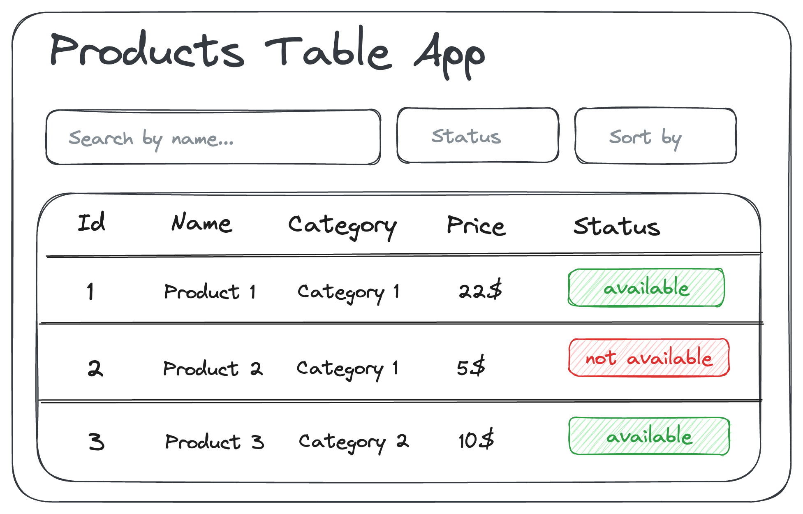

# Prueba Técnica: Aplicación de Lista de Productos en React (Básica)

## Descripción

Desarrollar una aplicación en React que visualice datos de un archivo JSON proporcionado. La aplicación debe permitir al usuario interactuar con los datos de diversas maneras.

## Nivel de Dificultad

Básico

## Funcionalidades

### Carga y Visualización de Datos:

- Cargar los datos del archivo JSON proporcionado.
- Mostrar una lista de productos en una tabla.

### Búsqueda de Productos:

- Un campo de texto para buscar productos por nombre.

### Filtrado de Productos:

- Un botón para filtrar los productos por disponibilidad.

### Ordenamiento de Productos:

- Un botón para ordenar los productos por nombre o precio (ascendente).

## Estructura Técnica

### Estilos

- Uso de CSS Vanilla / Modules o Tailwind CSS.

### Wireframe

